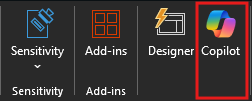

# Erstellen neuer Folien, Agenden und Aufgabenlisten mit Microsoft 365 Copilot in PowerPoint

Microsoft 365 Copilot in PowerPoint ist eine KI-gesteuerte Funktion, mit der Sie Folien erstellen, gestalten und formatieren können.  Sie können eingeben, was Sie mit der Präsentation vermitteln möchten und Copilot hilft Ihnen, diese Ziele umzusetzen.

Mit Copilot können Sie diese anfänglich leere Folie leicht füllen und finden schnell die richtige Richtung. Um Copilot in PowerPoint zu verwenden, können Sie den **Copilot**-Bereich über das Copilot-Symbol auf der Registerkarte **Startseite** des Menübands öffnen.

Im Bereich "Copilot" können Sie mit dem Erstellen einer neuen Präsentation aus einem Word-Dokument oder zu einem gewünschten Thema beginnen. Im Beispiel beginnen wir mit einer grundlegenden Anfrage, eine Präsentation zu einem Thema zu erstellen, und fügen weitere Elemente hinzu, um den Prompt zu verbessern.

> [!TIP]
> Derzeit kann Copilot in PowerPoint nur Präsentationen aus Word-Dokumenten erstellen.

## Lassen Sie uns loslegen

Wenn Sie dies noch nicht getan haben, laden Sie die folgenden Dateien herunter, und speichern Sie die Datei in Ihrem **OneDrive-Ordner**, damit sie in Ihrer MRU-Liste angezeigt werden:

- **_[Market Trend Report- Protein shake.docx](https://go.microsoft.com/fwlink/?linkid=2268827)_**

> [!NOTE]
> Prompt wird gestartet:
>
> _Erstelle eine neue PowerPoint-Präsentation._

In diesem einfachen Prompt beginnen Sie mit dem grundlegenden **Ziel**, _eine neue PowerPoint-Präsentation erstellen zu lassen._ Es gibt jedoch keine Informationen darüber, worum es in der Präsentation geht oder wie sie aussehen sollte.

| Element | Beispiel |
| :------ | :------- |
| **Grundlegender Prompt:** Beginnen Sie mit einem **Ziel** | **_Erstelle eine neue PowerPoint-Präsentation._** |
| **Guter Prompt:** Hinzufügen von **Kontext** | Durch Hinzufügen von **Kontext** kann Copilot besser verstehen, welche Art von Dokument Sie erstellen möchten und wofür es verwendet werden soll. _„Wir wollen potenzieller Kundschaft die Funktionen und Vorteile des Produkts präsentieren.“_ |
| **Besserer Prompt:** Angabe von **Quelle(n)** | Durch das Hinzufügen von **Quellen** kann Copilot wissen, wo nach bestimmten Informationen gesucht werden soll. _„... unter Verwendung der neuesten Erkenntnisse aus **/Market Trend Report-Protein-Shake.docx.“**_ |
| **Bester Prompt:** Festlegen von **Erwartungen** | Schließlich kann Copilot beim Hinzufügen von **Erwartungen** helfen, zu verstehen, wie das Dokument geschrieben und formatiert werden soll. _„Bitte füge eine Übersicht über das Produkt, seine wichtigsten Merkmale und Vorteile sowie einen Vergleich mit ähnlichen Produkten auf dem Markt bei. Bitte verwende eine einfache Sprache.“_ |

> [!NOTE]
> **Gestaltete Eingabeaufforderung:**
>
> _Erstelle eine neue PowerPoint-Präsentation unter Verwendung der neuesten Erkenntnisse aus **/Market Trend Report- Protein shake.docx**. Wir wollen potenzieller Kundschaft die Funktionen und Vorteile des Produkts präsentieren. Bitte füge eine Übersicht über das Produkt, seine wichtigsten Merkmale und Vorteile sowie einen Vergleich mit ähnlichen Produkten auf dem Markt bei. Bitte verwende eine einfache Sprache._

Mit dem **Ziel**, dem **Kontext**, der **Quelle** und den **Erwartungen** hat Copilot alles, was für eine großartige Antwort benötigt wird.

### Verweisen auf Quellen

Wenn Sie, wie im Beispiel, möchten, dass Copilot Ihre neue Präsentation auf einer bereits vorhandenen Datei erstellt, können Sie dies entsprechend angeben. Wählen Sie im Prompt-Fenster **Präsentation aus Datei erstellen** aus, um **_bis zu 3 Dateien_** auszuwählen, die Copilot bei der Erstellung Ihres neuen Dokuments berücksichtigen soll.

Im Feld „Erstellen“ können Sie auch „/“ und den Namen der Datei eingeben, auf die Sie verweisen möchten. Dadurch werden die im Menü angezeigten Dateioptionen aktualisiert.

> [!IMPORTANT]
> Sie müssen über die Berechtigung zum Zugriff auf die Dateien verfügen, auf die Sie verweisen, unabhängig davon, ob sie sich im SharePoint oder OneDrive Ihrer Organisation befinden und entweder Word- oder PowerPoint-Dateien sein können.

### Best Practices beim Erstellen einer Präsentation aus einem Word-Dokument

Nutzen Sie **Word-Formate**, um Copilot dabei zu helfen, die Struktur Ihres Dokuments zu verstehen. Wenn Sie **Formatvorlagen** in Word zur Organisation Ihres Dokuments verwenden, kann Copilot Ihre Dokumentstruktur besser verstehen und sie in Folien einer Präsentation aufteilen. Strukturieren Sie Ihre Inhalte unter **Titel** und **Header**, wenn dies angebracht ist, und Copilot wird das Beste tun, um eine Präsentation für Sie zu erstellen.

### Einschließen von Bildern, die für Ihre Präsentation relevant sind

Beim Erstellen einer Präsentation versucht Copilot, die Bilder in Ihr Word-Dokument zu integrieren. Wenn Sie Bilder haben, die Sie in Ihre Präsentation übertragen möchten, müssen Sie sie unbedingt in Ihr Word-Dokument einfügen.

### Beginnen Sie mit der Vorlage Ihrer Organisation

Wenn Ihre Organisation eine Standardvorlage verwendet, beginnen Sie mit dieser Datei, bevor Sie eine Präsentation mit Copilot erstellen. Wenn Sie mit einer Vorlage beginnen, weiß Copilot, dass Sie das Thema und das Design der Präsentation beibehalten möchten. Copilot verwendet vorhandene Layouts, um eine Präsentation für Sie zu erstellen.

> [!IMPORTANT]
> Diese Funktion steht Kundschaft mit einer Microsoft 365 Copilot-Lizenz oder Copilot Pro-Lizenz zur Verfügung. Weitere Informationen finden Sie unter [Erstellen einer Präsentation aus einer Datei mit Copilot](https://support.microsoft.com/office/create-a-new-presentation-3222ee03-f5a4-4d27-8642-9c387ab4854d).
