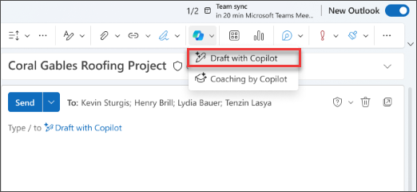

# Entwerfen von E-Mails, Antworten und Agenden für Besprechungen mit Microsoft 365 Copilot in Outlook

Copilot in Outlook erleichtert die Posteingangsverwaltung mit KI-gesteuerter Unterstützung, damit Sie E-Mails schnell schreiben und lange E-Mail-Threads in kurze Zusammenfassungen umwandeln können. Es kombiniert die Leistungsfähigkeit großer Sprachmodelle (LLMs) mit Outlook-Daten, damit Sie am Arbeitsplatz produktiv bleiben können. Es fasst E-Mail-Threads (auch als Unterhaltungen bezeichnet) zusammenfassen und extrahiert wichtige Punkte aus mehreren Nachrichten.

> [!NOTE]
> Entwurf in Outlook für Microsoft 365 ist derzeit in neuen Outlook für Windows, Outlook im Web und Outlook.com verfügbar. Wenn Sie die klassische Outlook-Version verwenden, [sollten Sie sich die neue Outlook-Version](https://support.microsoft.com/office/start-using-new-outlook-for-windows-4395454d-cb2f-4c16-bb24-fa4bb36650ae) herunterladen. Wenn Sie nicht darauf zugreifen können, wenden Sie sich an Ihren IT-Admin.

Mit der Unterstützung von Copilot in Outlook erstellen Sie schnell eine E-Mail oder eine Antwort in einer Unterhaltung.

1. Wählen Sie in Outlook **iStartseite > Neue E-Mail > E-Mail** aus.

1. Um eine neue Nachricht zu beginnen, wählen Sie in der Symbolleiste das **Copilot-Symbol** aus.

1. Wählen Sie im Dropdown-Menü **iEntwurf mit Copilot** aus.

    

1. Geben Sie in das Copilot-Feld **Ihren Prompt** ein.

1. Wählen Sie **Optionen erstellen** aus, um die gewünschte Länge und den gewünschten Ton auszuwählen.

    

1. Wählen Sie abschließend **Erstellen** aus. Copilot erstellt eine Nachricht für Sie.

1. Überprüfen Sie die Nachricht. Wenn sie nicht ganz ihren Vorstellungen entspricht, wählen Sie **Entwurf neu erstellen** aus und Copilot erstellt eine neue Version.

1. Um zu beginnen, ändern Sie Ihre Eingabeaufforderung und wählen erneut **Generieren** aus.

1. Wenn Sie mit dem Ergebnis zufrieden sind, wählen Sie **Beibehalten** aus.

1. Bearbeiten Sie den Entwurf nach Bedarf, und wählen Sie anschließend **Senden** aus.

    

## Lassen Sie uns loslegen

> [!NOTE]
> Prompt wird gestartet:
>
> _Entwirf eine neue E-Mail._

In diesem einfachen Prompt beginnen Sie mit dem grundlegenden **Ziel**, _eine neue E-Mail verfassen zu lassen._ Es gibt jedoch keine Informationen darüber, worum es bei der E-Mail geht, an wen sie gesendet werden soll oder wie sie klingen soll.

| Element | Beispiel |
| :------ | :------- |
| **Grundlegender Prompt:** Beginnen Sie mit einem **Ziel** | **_Entwirf eine neue E-Mail._** |
| **Guter Prompt:** Hinzufügen von **Kontext** | Durch Hinzufügen von **Kontext** kann Copilot besser verstehen, worum es in der E-Mail gehen soll und wer die Zielgruppe ist. _„... an meinen Kunden Allan Deyoung bezüglich des Status des Supporttickets.“_ |
| **Besserer Prompt:** Angabe von **Quelle(n)** | Durch das Hinzufügen von **Quellen** kann Copilot wissen, wo nach bestimmten Informationen gesucht werden soll. _„Siehe das neueste Update aus meinen Notizen: Das Problem wurde an den Support der Stufe 2 weitergeleitet und eine Lösung wird innerhalb von 48 Stunden erwartet.“_ |
| **Bester Prompt:** Festlegen von **Erwartungen** | Schließlich kann Copilot beim Hinzufügen von **Erwartungen** helfen, zu verstehen, wie das Dokument geschrieben und formatiert werden soll. _„Die E-Mail sollte einen professionellen und technischen Eindruck machen, aber mit Empathie geschrieben sein.“_ |

> [!NOTE]
> **Gestaltete Eingabeaufforderung:**
>
> _Entwerfe eine neue E-Mail an meinen Kunden, Allan Deyoung, bezüglich des Status des Supporttickets. Beziehe dich auf das neueste Update aus meinen Notizen: Das Problem wurde an den Support der Stufe 2 weitergeleitet und eine Lösung wird innerhalb von 48 Stunden erwartet. Die E-Mail sollte einen professionellen und technischen Eindruck machen, aber mit Empathie geschrieben sein._

In diesem Prompt hat Copilot alle Informationen, die benötigt werden, um Ihnen eine solide Antwort zu geben, dank des **Ziels**, des **Kontexts**, der **Quelle** und der **Erwartungen** in diesem Prompt.

> [!IMPORTANT]
> Copilot in Outlook unterstützt derzeit nur Arbeits- oder Schulkonten sowie Microsoft-Konten mit den E-Mail-Adressen outlook.com, hotmail.com, live.com und msn.com. Jedes Microsoft-Konto, das ein Konto eines Drittanbieters für E-Mail-Dienste wie Gmail, Yahoo oder iCloud verwendet, kann weiterhin Outlook verwenden, hat jedoch keinen Zugriff auf die Copilot-Funktionen in Outlook. Weitere Informationen finden Sie unter [Entwerfen einer E-Mail-Nachricht mit Copilot in Outlook](https://support.microsoft.com/office/draft-an-email-message-with-copilot-in-outlook-3eb1d053-89b8-491c-8a6e-746015238d9b).
