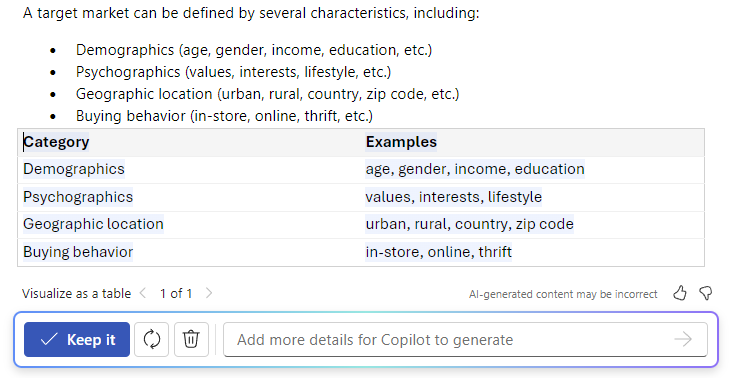

# Schreiben, Organisieren und Transformieren von Inhalten mithilfe von Microsoft 365 Copilot in Word

Mit dem Microsoft 365 Copilot in Word können Sie beim Verfassen neuer Inhalte im Flow bleiben und Ihre Inhalte umgestalten, sobald Sie Ihre Ideen aufgeschrieben haben. Copilot kann Ihren Text umschreiben und sogar den Ton der Texte anpassen. Copilot wandelt Ihren Text nach Bedarf auch in eine bearbeitbare Tabelle um. Transformieren Sie Inhalte in Word mit folgenden Schritten:

## Umschreiben nach Tonfall

1. Wählen Sie den Text aus, den Copilot umschreiben soll.

1. Wählen Sie am linken Rand neben dem Text das Symbol **Copilot** aus.

1. Wählen Sie aus dem Copilot-Menü am linken Rand **Umschreiben**.

1. Copilot zeigt Ihnen neu geschriebene Optionen an, aus der Sie wählen können.

1. Wählen Sie **Ersetzen** aus, um den überarbeiteten Text zu verwenden, **Unten einfügen**, um den neu geschriebenen Text unter dem aktuellen Text einzufügen, **Neu generieren**, um die Vorschläge von Copilot neu zu generieren, oder **Ton anpassen**, um den neu geschriebenen Text an den gewünschten Tonfall anzupassen.

    

## Text in Tabelle

1. Wählen Sie den Text aus, den Copilot in eine Tabelle umwandeln soll.

1. Wählen Sie am linken Rand neben dem Text das Symbol **Copilot** aus.

1. Wählen Sie im Copilot-Menü am linken Rand die Option **Als Tabelle visualisieren** aus.

1. Copilot zeigt Ihnen, wie die Tabelle aussieht.

1. Wählen Sie **Beibehalten** aus, um die Tabelle in das Dokument einzufügen, **Erneut generieren**, damit Copilot die Tabelle erneut generiert, oder wählen Sie **Verwerfen** aus, um die Tabelle zu entfernen.

1. Um die Tabelle zu optimieren, können Sie Details der gewünschten Änderungen an der Tabelle in das Eingabefeld von Copilot eingeben.

    1. Mit dem Eingabefeld von Copilot kann die Formatierung einer Tabelle nicht geändert werden. Sie kann mit den Tabellenoptionen im Word-Menüband geändert werden.

    

Im folgenden Beispiel beginnen wir mit einem einfachen Prompt, um Text in eine Tabelle umzuwandeln und fügen dabei Elemente hinzu. Folgen Sie dem Beispiel mit Ihren eigenen Daten.

## Lassen Sie uns loslegen

Laden Sie zunächst **_[Graphic Design Institute - Employee Benefits.docx](https://go.microsoft.com/fwlink/?linkid=2268825)_** herunter und speichern Sie die Datei in Ihrem **OneDrive Ordner**, falls Sie dies noch nicht getan haben.

Öffnen Sie das Dokument in Word, und markieren Sie den gesamten Text im Dokument (drücken Sie **STRG-A**). Wählen Sie im Copilot-Menü am linken Rand die Option **Als Tabelle visualisieren** aus. Nachdem Sie die Tabelle erstellt haben, verwenden Sie Copilot, um Ihre Ergebnisse mithilfe der folgenden Prompts zu verfeinern.

> [!NOTE]
> Prompt wird gestartet:
>
> _Visualisiere sie als Tabelle._

In diesem einfachen Prompt beginnen Sie mit dem grundlegenden **Ziel**, _Text in eine Tabelle umzuwandeln._ Es gibt jedoch keine Hinweise darauf, welche Informationen Sie in der Tabelle haben möchten oder warum es eine Tabelle sein sollte.

| Element | Beispiel |
| :------ | :------- |
| **Grundlegender Prompt:** Beginnen Sie mit einem **Ziel** | **_Visualisiere sie als Tabelle._** |
| **Guter Prompt:** Hinzufügen von **Kontext** | Durch Hinzufügen von **Kontext** kann Copilot verstehen, welche Art von Daten angezeigt werden sollen und wofür sie verwendet werden. _„Wir möchten diese Vorteile potenziellen Mitarbeitenden verdeutlichen und mitteilen.“_ |
| **Besserer Prompt:** Angabe von **Quelle(n)** | Die **Quelle** in diesem Beispiel ist der gesamte Text von **Graphic Design Institute - Employee Benefits.docx**. |
| **Bester Prompt:** Festlegen von **Erwartungen** | Schließlich kann das Hinzufügen von **Erwartungen** Copilot dabei helfen, zu verstehen, wie Sie die Tabelle organisiert und geschrieben haben möchten. _„Füge eine dritte Spalte hinzu, die den Nutzen für die Mitarbeitenden eindeutig beschreibt und wie sich diese Vorteile auf ihr Wohlbefinden auswirken.“_ |

> [!NOTE]
> **Gestaltete Eingabeaufforderung:**
>
> _Visualisiere es als Tabelle. Wir müssen diese Vorteile potenziellen Mitarbeitenden auf klare Weise vermitteln. Füge eine dritte Spalte hinzu, die den Nutzen für die Mitarbeitenden eindeutig beschreibt und wie sich diese Vorteile auf ihr Wohlbefinden auswirken._

Dieser Prompt gibt Copilot alles, was benötigt wird, um eine gute Antwort zu finden, einschließlich **Ziel**, **Kontext**, **Quelle** und **Erwartungen**.

> [!IMPORTANT]
> Diese Funktion steht Kundschaft mit einer Microsoft 365 Copilot-Lizenz oder Copilot Pro-Lizenz zur Verfügung. Weitere Informationen finden Sie unter [Transformieren Ihrer Inhalte mit Copilot in Word](https://support.microsoft.com/office/transform-your-content-with-copilot-in-word-923d9763-f896-4da7-8a3f-5b12c3bfc475).
