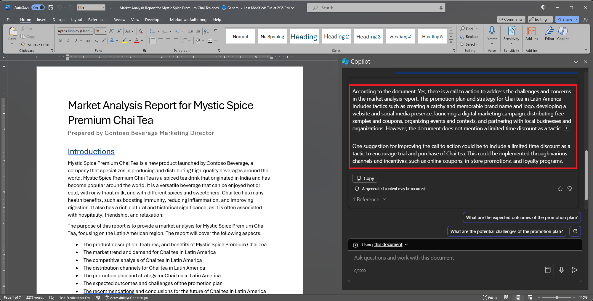

Um mit Copilot in Word zu chatten, können Sie den Bereich **Copilot** öffnen, indem Sie das Copilot-Symbol auf der Registerkarte **Startseite** im Menüband auswählen. 

Neben dem Erstellen von Inhalten oder dem Generieren von Ideen bietet Copilot in Word die Möglichkeit, Fragen zu dem Dokument zu beantworten, das Sie lesen. Wenn Copilot auf Ihre Eingabeaufforderung antwortet, können Sie auch Verweise mit Zitaten anzeigen, woher Copilot in Ihrem Dokument Informationen abgerufen hat.

## Fragen zu diesem Dokument stellen

- Fasse dieses Dokument zusammen – Müssen Sie schnell des Wesentliche des Dokuments erschließen? Geben Sie „Fasse dieses Dokument zusammen“ in den Chatbereich von Copilot ein, um eine Zusammenfassung des Dokuments zu erhalten.

- „Gibt es einen Handlungsaufruf?“... – Möchten Sie wissen, ob das Dokument einen sinnvollen Handlungsaufruf enthält? Fragen Sie Copilot, und es wird versuchen, es Ihnen mitzuteilen.

## Offene Fragen stellen

Möchten Sie Ihrem Dokument Inhalte oder Kontext hinzufügen? Stellen Sie Copilot allgemeine Fragen, und es wird versuchen, Ihnen Antworten zu geben. Zum Beispiel: 

- Wie kann ich dieses Dokument bearbeiten, um es akademischer zu gestalten?

- Gibt es ein Zitat von einem US-Präsidenten zum Thema „Mut“?

Wenn diese Antworten nicht im Dokument enthalten sind, generiert Copilot Inhalte mit den zugrunde liegenden großen Sprachmodellen. Wenn Sie etwas gefunden haben, das Ihnen gefällt und dem Dokument hinzugefügt werden soll, können Sie es einfach im Copilot-Bereich kopieren und in das Dokument einfügen.

## Lassen Sie uns loslegen

Laden Sie zunächst die Datei **_[Market Analysis Report for Mystic Spice Premium Chai Tea.doc](https://go.microsoft.com/fwlink/?linkid=2268826)_** herunter und speichern Sie sie in Ihrem **OneDrive-Ordner**, falls Sie dies noch nicht getan haben.

Öffnen Sie das Dokument in Word und öffnen Sie dann den Bereich **Copilot**, indem Sie das Copilot-Symbol in der Registerkarte **Startseite** der Multifunktionsleiste auswählen. Geben Sie die untenstehenden Prompts ein und folgen Sie den Anweisungen.

> [!NOTE]
> Prompt wird gestartet:
>
> _Gibt es eine Handlungsaufforderung?_

In diesem einfachen Prompt beginnen Sie mit dem grundlegenden **Ziel**: _eine sinnvolle Handlungsaufforderung im Dokument zu finden._ Sie haben aber immer noch nicht erklärt, _warum_ Sie diese Informationen benötigen.

| Element | Beispiel |
| :------ | :------- |
| Einfacher Prompt:  Beginnen Sie mit einem **Ziel** | **_Gibt es eine Handlungsaufforderung?_** |
| Guter Prompt:  **Quelle(n)** angeben | Das Hinzufügen von **Quellen** kann Copilot dabei helfen, nach bestimmten Informationen zu suchen.  „_... in diesem Marktanalysebericht..._“ |
| Besserer Prompt:  **Kontext** hinzufügen | Das Hinzufügen von **Kontext** kann Copilot helfen, mit Kontext zu reagieren und Ihnen eine maßgeschneiderte Antwort zu geben.  „_...um auf unsere Herausforderungen und Bedenken einzugehen. Bitte überprüfe, ob der Marketingplan einen klaren und spezifischen Aktionsplan enthält, wie z. B. einen Werbeplan oder einen zeitlich begrenzten Rabatt._“ |
| Besserer Prompt:  Klare **Erwartungen** festlegen | Und schließlich kann das Hinzufügen von **Erwartungen** Copilot helfen, zu verstehen, was genau Sie brauchen, anstatt Ihnen nur eine pauschale _Ja_ oder _Nein_ Antwort zu geben.  „_Bitte mache bei Bedarf Vorschläge zur Verbesserung der Handlungsaufforderung._“ |

> [!NOTE]
> **Gestaltete Eingabeaufforderung:**
>
> _Gibt es eine Handlungsaufforderung in diesem Marktanalysebericht, um unsere Herausforderungen und Bedenken anzusprechen? Bitte überprüfe, ob der Marketingplan einen klaren und spezifischen Aktionsplan enthält, wie z. B. einen Werbeplan oder einen zeitlich begrenzten Rabatt. Bitte mache bei Bedarf Vorschläge zur Verbesserung der Handlungsaufforderung._

Dieser Prompt gibt Copilot alles, was benötigt wird, um eine gute Antwort zu finden, einschließlich **Ziel**, **Kontext**, **Quelle** und **Erwartungen**.

> [!IMPORTANT]
> Diese Funktion steht Kundschaft mit einer Microsoft 365 Copilot-Lizenz oder Copilot Pro-Lizenz zur Verfügung. Weitere Informationen finden Sie unter [Chatten mit Copilot über Ihr Word-Dokument](https://support.microsoft.com/office/chat-with-copilot-about-your-word-document-4482c688-a495-4571-bfcd-4a9fc6608090).
