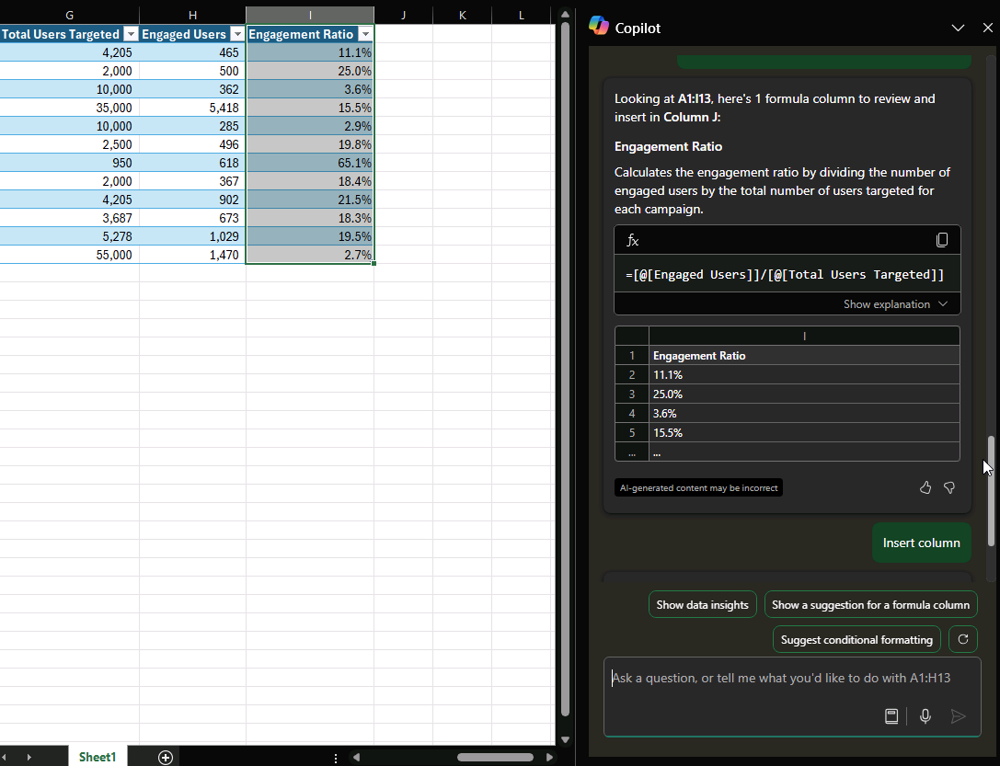

# Analysieren und Arbeiten mit Tabellen mithilfe von Microsoft 365 Copilot in Excel

Wenn Sie nicht sicher sind, wie Sie eine Formel für eine neue Spalte schreiben sollen, kann Microsoft 365 Copilot schnell neue Spalten mit Formeln basierend auf den Daten hinzufügen.

1. Wenn die Daten als Tabelle formatiert sind, wählen Sie im Menüband die Schaltfläche **Copilot** aus.

1. Wählen Sie **Formelspalten hinzufügen** oder **Vorschläge für Formelspalten anzeigen** aus. Sie können auch mit eigenen Worten beschreiben, welche Spalten Sie hinzufügen möchten.

1. Copilot stellt Formelvorschläge mit einer Erklärung zur Funktionsweise der einzelnen Formeln bereit. Wählen Sie **Formel erklären** aus, um die Erklärung anzuzeigen.

1. Wählen Sie „Spalte einfügen“ aus, um die Formelspalte zur Tabelle hinzuzufügen.

> [!IMPORTANT]
> Wie bei allen KI-generierten Inhalten ist es wichtig, alles zu überprüfen, zu bearbeiten und zu überprüfen, was Copilot für Sie erstellt.

## Lassen Sie uns loslegen

Laden Sie zunächst **_[Fabrikam Q1 marketing campaigns.xlsx](https://go.microsoft.com/fwlink/?linkid=2269124)_** herunter und speichern Sie die Datei in Ihrem **OneDrive-Ordner**, falls Sie dies noch nicht getan haben.

Öffnen Sie die Tabelle in Excel und öffnen Sie dann den Bereich **Copilot**, indem Sie das Copilot-Symbol in der Registerkarte **Startseite** der Menüleiste auswählen. Geben Sie die folgenden Prompts ein und folgen Sie den Anweisungen.

> [!NOTE]
> Prompt wird gestartet:
>
> _Schlage eine Formelspalte vor._

In diesem einfachen Prompt beginnen Sie mit dem grundlegenden **Ziel**, _eine neue Spalte mit einer Formel_ zu erstellen. Es gibt jedoch nicht genügend Details, um zu bestimmen, welche Formel berechnet werden soll.  

| Element | Beispiel |
| :------ | :------- |
| **Grundlegender Prompt:** Beginnen Sie mit einem **Ziel** | **_Schlage eine Formelspalte vor._** |
| **Guter Prompt:** Hinzufügen von **Kontext** | Das Hinzufügen von **Kontext** hilft Copilot zu verstehen, was die Formel berechnen soll. _„… für Spalte J, um das Engagement-Verhältnis jeder Kampagne zu berechnen.“_ |
| **Besserer Prompt:** Angabe von **Quelle(n)** | Die **Quelle** für diesen Prompt sind die spezifischen Spalten, die für die Berechnung benötigt werden. _Verwende die Werte aus „Engagierte Benutzende“ und „Gesamtzahl der angesprochenen Benutzenden“._ |
| **Bester Prompt:** Festlegen von **Erwartungen** | Durch das Hinzufügen von **Erwartungen** kann Copilot die Formel korrekt strukturieren. _„Stelle sicher, dass die Formel ‚Engagierte Benutzende‘ durch ‚Gesamtzahl der anvisierten Benutzenden‘ dividiert und das Ergebnis als Prozentsatz formatiert wird.“_ |

> [!NOTE]  
> **Gestaltete Eingabeaufforderung:**  
>
> _Schlage eine Formel für Spalte J vor, um die Engagement-Quote jeder Kampagne zu berechnen. Verwende die Werte aus „Engagierte Benutzende“ und „Gesamtzahl der angesprochenen Benutzenden“. Stelle sicher, dass die Formel „Engagierte Benutzende“ durch „Gesamtzahl der angesprochenen Benutzenden“ dividiert und das Ergebnis als Prozentsatz formatiert wird._  

Copilot hat alle Informationen, die er benötigt, um Ihnen eine solide Antwort zu geben, dank des **Ziels**, **Kontexts**, **Ursprungs** und **Erwartungen** in diesem Prompt.

## Mehr entdecken

Verwenden Sie diese Eingabeaufforderungen als Ausgangspunkt. Kopieren Sie sie, und ändern Sie sie entsprechend Ihren Anforderungen.

- Berechnen Sie die Gesamtkosten pro Produkt in einer neuen Spalte.

- Fügen Sie eine Spalte hinzu, die den Gesamtgewinn für jede Marketingkampagne im Jahr 2022 berechnet.

- Fügen Sie eine Spalte hinzu, die die Anzahl von Tagen nach dem Produkteinführungsereignis berechnet.

Weitere Informationen finden Sie unter [Generieren von Formelspalten mit Copilot in Excel](https://support.microsoft.com/office/generate-formula-columns-with-copilot-in-excel-d866d926-9791-4e5f-be2a-c6dd9e587a47).
